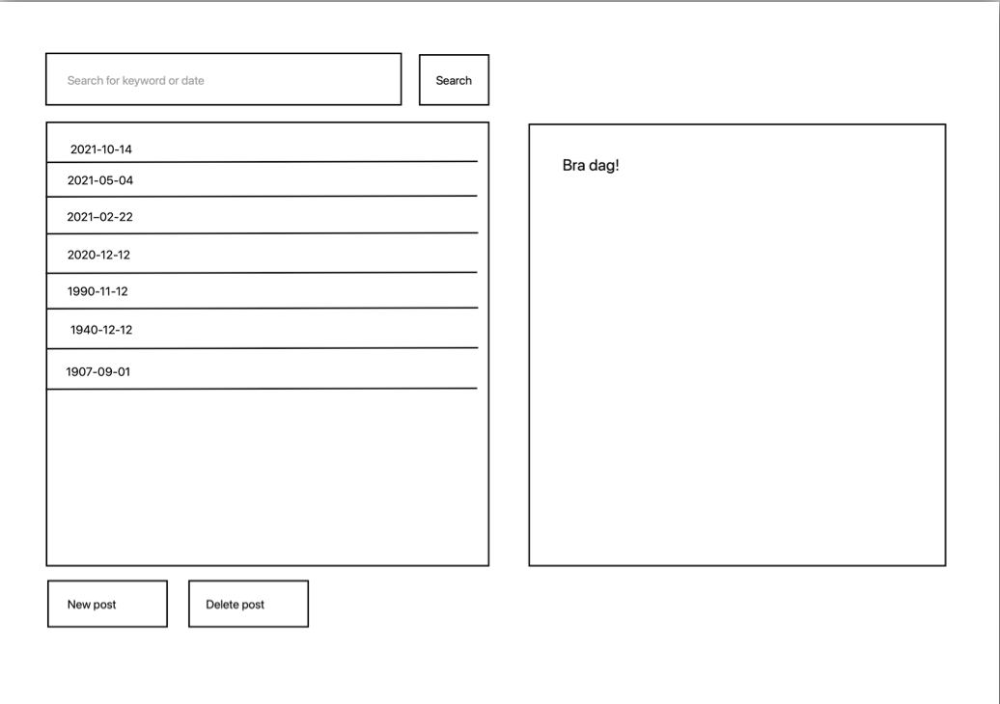
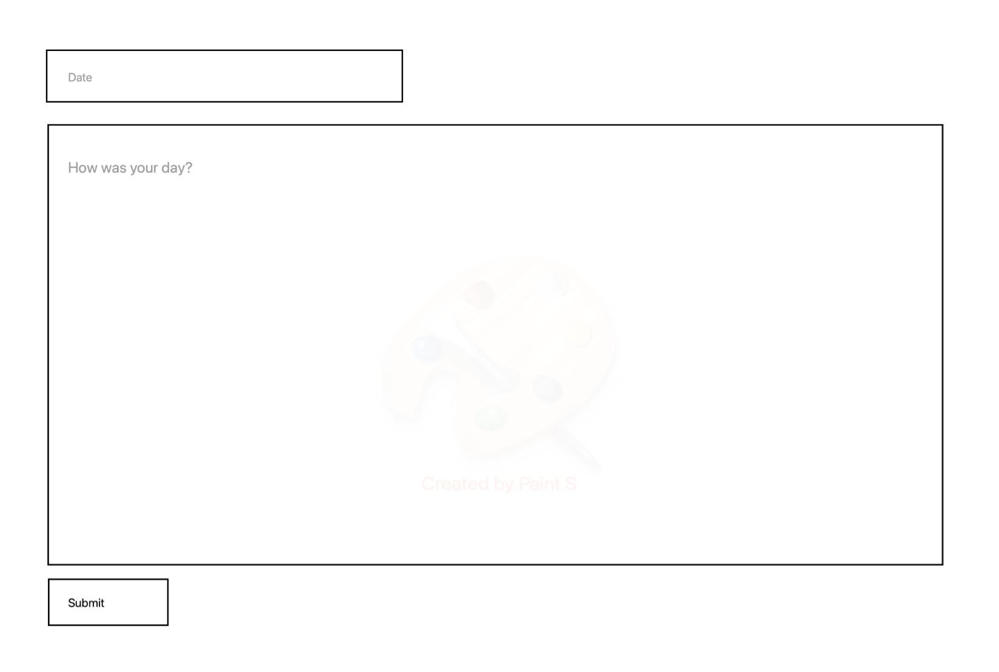
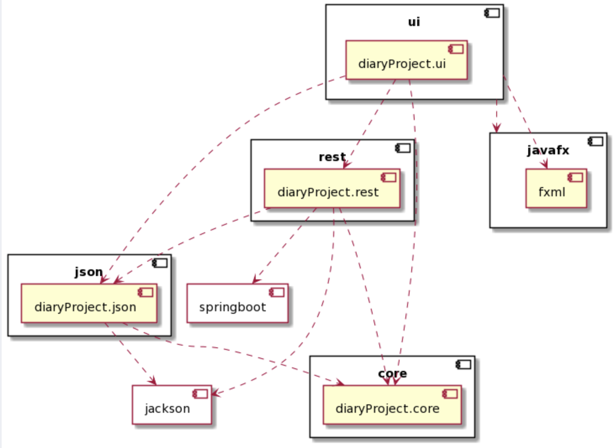
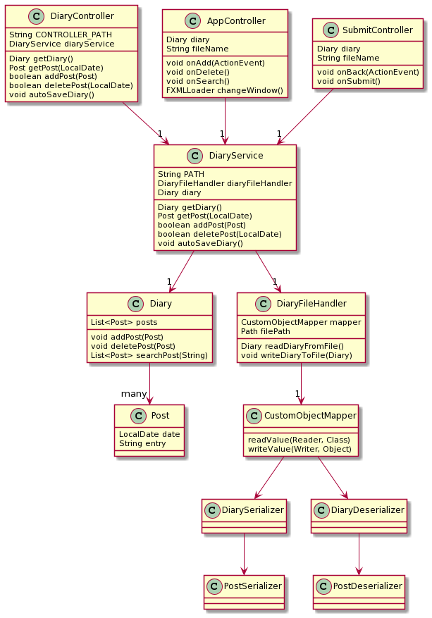

# Diary

​
This application will represent a diary where a user will be able to make and delete different posts in the diary. The information is stored permanently so the user can always access previous posts. The user will be able to search for words to quickly find a post previously written.
​
​

## User stories

​
The application has the following user-stories: 
​
1. As a user I want to write a post in order to write about my day.
2. As a user I want my posts to be stored persistently so I can find my previous posts.
3. As a user I want to delete a post to regret something I wrote.
4. ~~As a user I want to edit a post in order to change something I wrote.~~
5. As a user I want to search for keywords in a post in order to quickly look up known posts.
6. As a user I want to see a clean user interface so I intuitivley know how to use the diary.
7. As a user I want to see previous posts in a list in order to get an overview.
​

​User story 4 has not been implemented in the final app. For more information, go to [documentation for release 3](../docs/release3/Documentation.md) 

## Goal product

The goal is to create an app where the user can write a diary post, containing the date and entry-text. The main page will contain a field that lists the diary posts, a field to display the entry of a selected post, a search-field and -button, delete-button, and a button for adding new posts which opens a new window. This window contains fields for date and entry, as well as a submit-button.  
The list of posts will be sorted by date. In the search field, the user can search for posts by date or keywords. They can select a specific post to view and/or delete.

The following is a representation of the user interface of the finished product:

## Structure

Following is the package diagram of the application:

