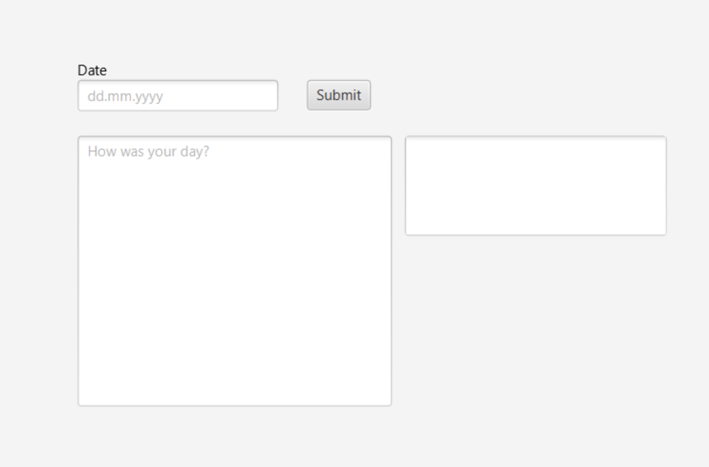

# Documentation Release 1
The main focus of release 1 was to create a minimum viable product that met the correct requirements.
This release meets the following requirements:

- Graphical user interface
  1.  A basic fxml interface with a button, textfields and a textarea. The user can put in a date, and an entrytext
- Persistence
  1.  After writing an entry the user can press the save button and the entry is saved in the JSON files.
- Logic
  1.  Simple validation of the date input (valid date and input format) in the Post class as well as a Diary class containing Post objects.
      These requirements were met by completing user stories 1 and 2.

1. As a user I want to write a post in order to write about my day.
2. As a user I want my posts to be stored persistently so I can find my previous posts.

## Current product

​
​
The following is a representation of the user interface of the diary for iteration 1:

​
When you first open the app you are met by a page where you can write your diary post. The date input is used to identify posts, and the textarea is where you can write your diarytext. If you press the submit button, your entry is saved in the app. If the date is written incorrectly, you will get a warning message.

