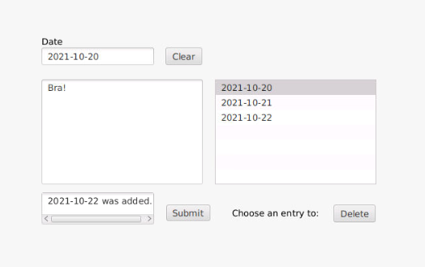

# Documentation release 2

The goal of this release was to fix any problems we had from the previous iteration and to meet the correct requirements. 
This release meets the following:

- Testing 
    1. Tests for core, json and ui module
    2. Test coverage using Jacoco
- Modularization
    1. Separated modules with dependencies 
    2. Project built by maven
- Persistence
    1. Selected a desktop model for saving to file. We used this model because:
        - It allows the user more control over what is saved in the diary.
        - The use of a "Submit"-button implies that the entry is saved when pressed, and not continuously.

The following user stories were completed for this release: 

    3. As a user I want to delete a post to regret something I wrote.
    7. As a user I want to see previous posts in a list in order to get an overview.

- Work flow:
    - Prioritized working in pairs as much as possible, as it prevented misunderstandings and secured better code quality.
    - Made an issue for each requirement. However, a lot of smaller tasks appear during the process that we forgot to add as issues. We will strive
      to make issues for every change as we continue with the project. As a result of this, fewer commits are connected to issues. 

## Current product

The following is a representation of the user interface of the diary for iteration 2:

When you first open the app you are met by a page where you can write your diary post. The date input is used to identify posts, and the textarea is where you can write your diarytext. If you press the submit button, your entry is saved in the app. If the date is written incorrectly or an entry already exists for that date, you will get a warning message. If the input is valid, the entry will be added to the diary and appear in the listview. To read old entries, one can click the dates in the listview, and it will appear in the textfields. To delete an entry, one can click the delete button after the entry is selected. To write a new entry, one can use the Clear-button to clear out the textfields if needed.

### Running the Test
For this iteration the ui test will only work the first time it is run. This is because we create post element in the actual diary.json file when we add posts in the test, but we do not delete it after. We have implemented error handling for when you write a new diary post with a date that already exists, and this is the error message we get if we run the test twice: “Expected: 2020-05-07 was added.  but was: Date already exists. . For the next iteration, we will clear all data that is added in the tests so that this duplicate error message is not to be found. 

