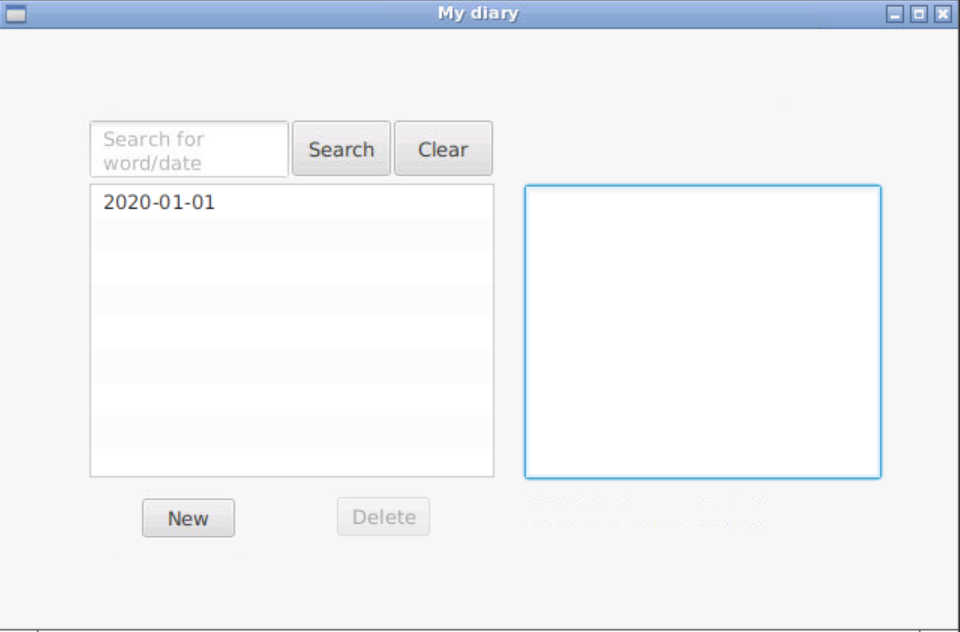
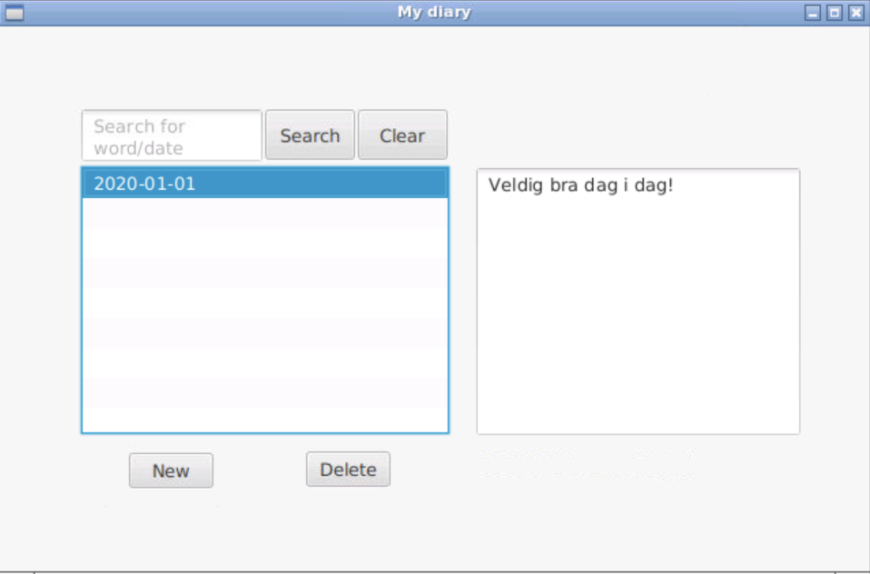
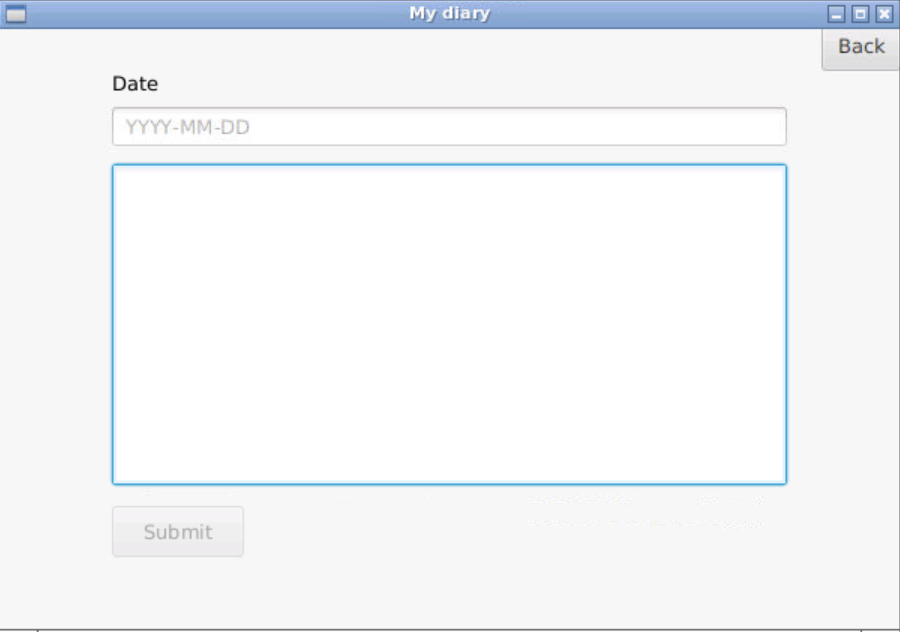

# Documentation release 3
For the third and final release, the goal was to complete all user stories, meet all requirements and deliver a finished product. 

## User stories

The following user stories were completed for this release: 

    5. As a user I want to search for keywords in a post in order to quickly look up known posts.
    6. As a user I want to see a clean user interface so I intuitivley know how to use the diary.
    7. As a user I want to see previous posts in a list in order to get an overview

The finished product fulfills all the user stories we set as a definite goal, except user story 4. 

    4. As a user I want to edit a post in order to change something I wrote.

We implemented the editing functionality and the app was running with edit function. However as we implemented springboot with its server, the edit funcitonality stopped working. We found it challenging to find a solution, so we decided to not include editing in the final product and save time.

## Current product
The following is a representation of the user interface of the diary for iteration 3:

<figure>

<figcaption>Fig.1 Main diary page with one post</figcaption>
</figure>
<figure>

<figcaption>Fig.2 Main diary page after selecting a post</figcaption>
</figure>
<figure>

<figcaption>Fig.3 New window that is opened when "New" is pressed</figcaption>
</figure>

## Tests
Tests are automatically run when opening the project. After the second release we had issues with files during testing, as the tests wrote to the same files as running the app did. To solve this issue, we have created 2 new controllers:
1. AppTestController
2. SubmitTestController

These controllers are copies of the original controllers with similar names, used in the app. The exception is that AppTestController has some extra getters used for testing, SubmitTestController does not have automatic valitation implemented and both controllers uses separate files for testing. 

# REST

​New for this iteration is the implementation of a REST-API, and connecting the application to a server. To do this, we used Spring Boot.

The server is started by using cmd: mvn -pl rest spring-boot:run in diaryProject. It is run on localhost:8080.

Endpoint for the REST-API is "/diary". We have implemented the following methods:

- GET: reading the complete diary - using "/diary"
- GET: reading a single post - using "/diary/{date}"
- POST: adding a post - using "/diary/{post}"
- DELETE: deleting a post - using "/diary/{date}"
